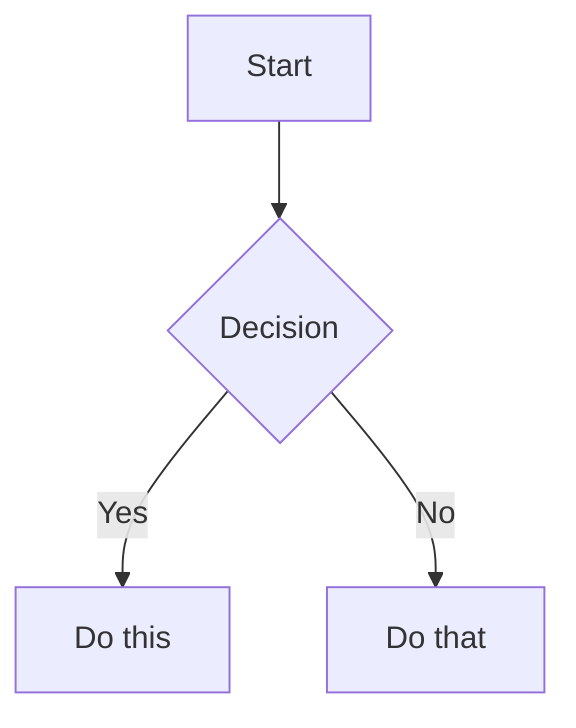

Save a knowledge note to the TIL vault at the path specified by the `TIL_VAULT_PATH` environment variable. If not set, default to `~/Github/til`.

## Rendering Contract (read this first)

The vault has **two readers**: Obsidian (personal) and GitHub (public repo). Every note must render correctly in **both**. This constrains the syntax, and it deliberately **overrides three things the `obsidian-markdown` skill recommends**:

| `obsidian-markdown` says | This vault does instead | Why |
|---|---|---|
| Link notes with `[[wikilinks]]` | Relative Markdown links: `[note-name](../folder/note-name.md)` | GitHub renders `[[x]]` as literal text. Obsidian resolves relative links and still tracks renames. |
| Embed with `![[note#Heading]]` | **Never embed.** Inline the content. | GitHub renders `![[x]]` as literal text. |
| `==highlight==`, `%%comment%%` | **Never use.** | GitHub shows both verbatim — `%%comment%%` leaks text meant to be hidden. |

Everything else from `obsidian-markdown` applies: properties, callouts, Mermaid, footnotes, standard Markdown.

## Instructions

### Step 1 — Identify the knowledge point

Topic argument (may be empty): $ARGUMENTS

Review the current conversation to identify the knowledge point to save. If a topic was supplied above, focus on that topic. Otherwise, identify the most recent technical Q&A in the conversation.

**If the knowledge came from a web page** (the user pasted a URL, or the conversation is grounded in an article/doc):

1. Use the `defuddle` skill to extract clean Markdown: `defuddle parse <url> --md`
2. If the CLI is missing (`defuddle: command not found`), install it: `npm install -g defuddle`. If installation is not possible, fall back to `WebFetch`.
3. Record the URL in the note's `source:` property (see Step 5).

Skip this entirely when the knowledge came from the conversation itself — which is the common case.

### Step 2 — Determine the note type (Diataxis)

Based on the conversation content, classify the note into one of these types:

| User signal in conversation | Note type | Writing style |
|---|---|---|
| "Why..." / "internals" / "how does X work" / understanding principles | **explanation** | Focus on *why* and *how it works internally*. Structure: Context → Core concept → Trade-offs. Use diagrams/tables to illustrate. |
| "How to..." / "configure" / solving a specific problem | **how-to** | Focus on *steps to solve*. Structure: Goal → Prerequisites → Numbered steps → Expected result. Skip conceptual background. |
| "Parameters" / "API" / "options" / looking up specific facts | **reference** | Focus on *facts*. Structure: Consistent format per entry (name → type → default → description → example). Terse, scannable. |
| "Teach me..." / "walk me through" / learning something new | **tutorial** | Focus on *learning by doing*. Structure: Goal → Step-by-step with verifiable results. Minimise explanation, maximise doing. |

### Step 3 — Determine the category folder

Choose the best folder:
- `typescript/` - Type system, generics, compiler
- `node-js/` - Runtime, modules, performance, npm packages (BullMQ, ioredis, etc.)
- `fastify/` - Routes, plugins, lifecycle
- `react/` - Components, hooks, state management
- `claude-sdk/` - Agent SDK, MCP, tool calls
- `e2b/` - Sandbox, filesystem, runtime
- `multiplayer/` - MQTT, real-time communication, sync
- `architecture/` - Design patterns, system design
- `devops/` - K8s, Docker, CI/CD
- `redis/` - Redis data structures, commands, patterns
- `codex/` - Codex agent, sandboxing, local agent setup
- `mobile-web/` - iOS/Android web quirks, viewport, keyboard

If none fit, create a new category folder — **and in the same run, add it to the Categories list in `README.md`**. The README is the vault's GitHub landing page; a new folder that is not listed there is invisible to every reader who is not you. (`.base` indexes update themselves; the README does not.)

### Step 4 — Check for duplicates

Use Glob to search for existing notes on the same topic. If one exists, update it instead of creating a duplicate.

### Step 5 — Write the note

Load the `obsidian-markdown` skill for exact syntax, then apply the Rendering Contract above.

```markdown
---
type: explanation | how-to | reference | tutorial
tags: [category, specific-tech, ...]
created: YYYY-MM-DD
source: https://...
---

# Title

Content here...

## Related
- [other-note-name](../folder/other-note-name.md) - brief description (if relevant notes exist)
```

**Properties:**
- `type`, `tags`, `created` are required — `TIL.base` indexes on them, and a note without `type` will not appear in the index.
- `source` is optional. Include it only when the knowledge came from a URL (Step 1).

**Callouts — use only these five types.** They are the intersection of GitHub alerts and Obsidian callouts, so they render in both. Write the type in UPPERCASE, on its own line, with **no custom title and no folding** (GitHub supports neither):

```markdown
> [!NOTE]
> Background or context.

> [!TIP]
> A better approach, a shortcut.

> [!IMPORTANT]
> A prerequisite the reader must know first.

> [!WARNING]
> A trap, a counter-intuitive behavior. The most useful callout in a TIL.

> [!CAUTION]
> Something that will cause damage.
```

Do **not** use `[!info]`, `[!danger]`, `[!bug]`, `[!question]`, `[!example]`, `[!quote]`, or any other Obsidian type — GitHub renders them as a plain blockquote with the literal `[!bug]` text showing.

**Writing rules:**
- Filename: kebab-case summary (e.g., `bullmq-internals.md`)
- One concept per note
- Use tables, code blocks, and lists for clarity
- Write in the same language the user used in the conversation
- Follow the writing style for the note type (Step 2)
- Link related notes with **relative Markdown links** — use Glob to find them
- Reach for `> [!WARNING]` whenever the note records a trap, a footgun, or something that cost you time. That is what a TIL is for.
- Validation: apply the Diataxis check for the note type:
  - **explanation**: Does the reader understand the *why*, not just the *what*?
  - **how-to**: Can an experienced user complete the task without confusion?
  - **reference**: Can the user find a specific fact in under 30 seconds?
  - **tutorial**: Can a beginner complete it end-to-end?

### Step 6 — Add diagrams inline

If the note involves processes, flows, state machines, or system architecture, add a **Mermaid diagram inside the note itself**. Mermaid is the only diagram format that renders natively in both Obsidian and GitHub.

````markdown
## 流程


````

**Rules:**
- Never create a companion `-flow.md` / `-tree.md` note. A diagram belongs to exactly one note — put it there. Separate diagram files duplicate the note's outline, drift from it, and pollute every index that queries `type`.
- If a `mermaid-visualizer` skill is available, use it to produce syntactically valid Mermaid, then paste the block inline. Otherwise write the Mermaid directly — the `obsidian-markdown` skill documents the syntax.
- Do not use Excalidraw or Canvas: neither renders on GitHub.
- Skip diagrams entirely for a simple reference or how-to with no meaningful flow.

### Step 7 — Confirm

Tell the user: the file path, the note type, whether a diagram was added, the `source` if any, and any related notes that were linked.

The `TIL.base` index picks up the new note automatically — no index maintenance needed. Mention the README only if Step 3 created a new category folder.
